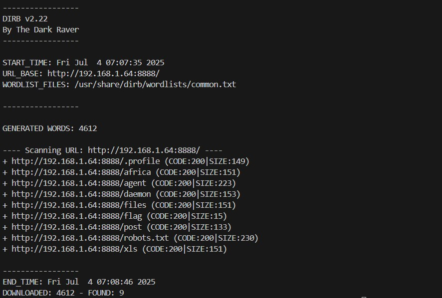
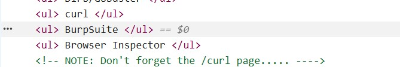
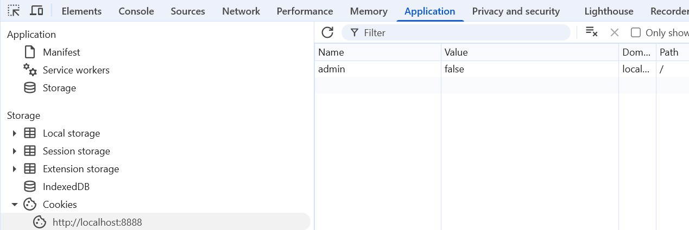
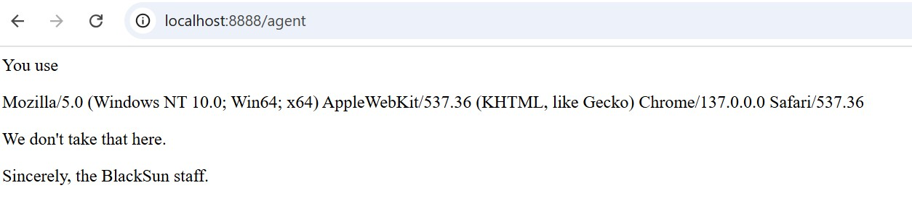

# Walkthrough
Here are instructions on how a user would find each flag on the site.

## Reconnaissance
The user should first run `dirb` to enumerate all the web pages. They will find 9 pages. 

The user should also inspect application using browser inspector/developer tools. They will find and HTML comment.

The user will also find a specific cookie listing their role. 

## Flag 1
The user will find this flag as they visit the pages in the results of their DIRB scan. They will visit the `robots.txt` page and find a flag.
```
flag{i_know_common_URIs}
```

## Flag 2
The user will find snippets of flags as they visit the pages in the results of their DIRB scan. They will visit the following pages:

* `.profile`
* `africa`
* `daemon`
* `xls`
* `files`

Each of these web pages has a number and a flag snippet. When the user puts the snippets in order of their numbers, they will find a flag.
```
flag{I_can_enumerate_websites}
```

## Flag 3
The user will visit the `flag` endpoint as they visit the pages in their Dirb results and will get a message saying they are not authorized. The user will recall the cookie they found showing their role as admin is false. If the user changes their cookie value to `true` they will get the flag.
```
flag{i_can_modify_clientside_cookies}
```

## Flag 4
The user will visit the `agent` endpoint as they visit the pages in their Dirb results. They will see a message listing their own user agent with a message from the BlackSun malware group.


A google search will show that the BlackSun malware group has their own common user-agent. The user can change their user-agent using curl like so:
```bash
curl http://localhost:8888/agent -A "BlackSun"
```
and receive the flag.
```
flag{i_can_change_user_agents}
```

## Flag 5
The user will visit the `curl` page as indicated by the HTML comment. If the user visits the page in the browser, the browser informs them to visit the page without a browser, which they can do with curl like so:
```bash
curl http://localhost:8888/curl
```
and get the flag
```
flag{i_can_use_curl}
```

## Flag 6
The user will visit the `/post` page as indicated by the HTML comment. The name of the endpoint should tip off the user they need to send a POST request, but the `OPTIONS` command will also show that the user should send a POST request like so:
```bash
curl http://localhost:8888/post -X POST
```
 As the user sends a POST request they will get the flag:
```
flag{i_can_change_HTTP_options}
```


